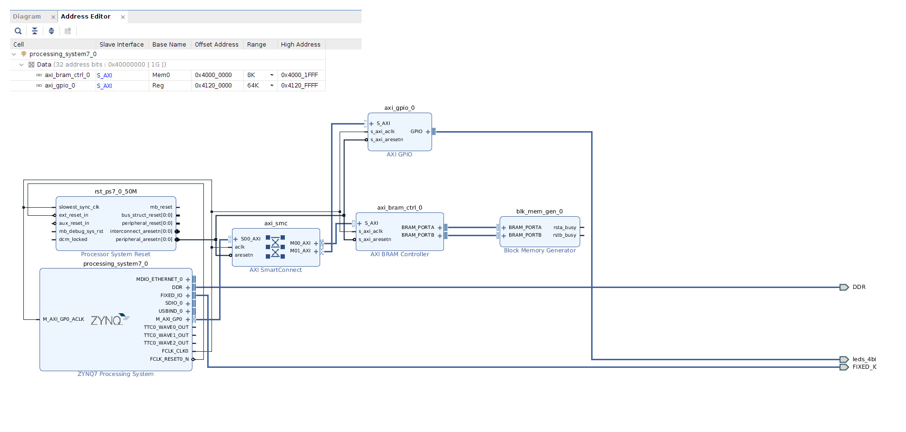

# Moje zabawy z petalinuxem
## BRAM i GPIO
### Hardware

Po przejściu wszystkich kroków generacji, Vivado stworzyło pliki `hw-decription` które można wykorzystać jako podstawę do zbudowania petalinux-a
### Konfiguracja dystrybucji
```
petalinux-create --type project --template zynq --name bram-gpio
cd <hardware-project-location.sdk>
petalinux-config --get-hw-description -p <petalinux-project-location>
cd <petalinux-project-location>
petalinux-config -c rootfs
``` 
Dodajemy odpowiednie biblioteki. Do wysyłki plików do FPGA przez USB konieczne jest wykorzystanie `sz/rz` czyli `lrzsz`: `Configuration → Filesystem Packages  → console  → network  → lrzsz`
``` 
petalinux-build
cd images/linux/
petalinux-package --boot --fsbl zynq_fsbl.elf --fpga bram_example_wrapper.bit --uboot --force
 ```
Wygenerowane pliki `images/linux/BOOT.BIN` i `images/linux/image.ub` przenosimy na kartę SD
### Pliki projektu
- Skrypty (katalog `scripts`)

`zrecv.sh` odbieranie plików z treminalu. Trzeba skonfigurować odpowiedni port USB
 
`zsend.sh` wysyłka plików z treminalu. Trzeba skonfigurować odpowiedni port USB

- LED Test

Program mrugający diodą LED 
